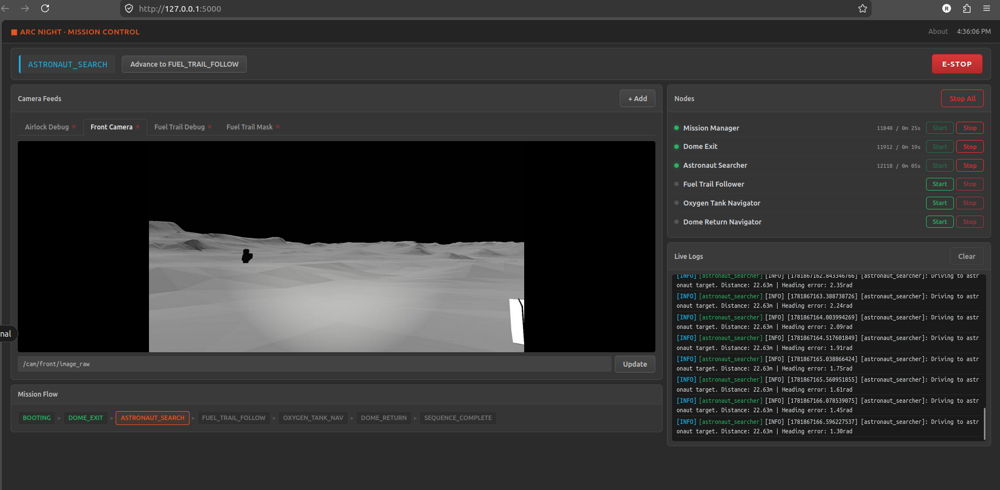

# Arc Night Mission

This sub-package is the **main mission pipeline** for the Arc Night competition track. It orchestrates a sequence of autonomous behaviors — from exiting a dome structure to returning home — and provides a **web-based dashboard** for real-time monitoring and control.

The mission is designed to run without Nav2 autonomy — all navigation is odometry-based with simple proportional controllers, and all perception is pure OpenCV vision processing.

---

## Mission Flow

The central finite state machine in `mission_manager.py` drives the mission through the following states:

```
BOOTING → DOME_EXIT → ASTRONAUT_SEARCH → FUEL_TRAIL_FOLLOW → OXYGEN_TANK_NAV → DOME_RETURN → SEQUENCE_COMPLETE
```

An `EMERGENCY_STOP` state is available at any point. `SEQUENCE_COMPLETE` and `EMERGENCY_STOP` are terminal states with no outgoing transitions.

### State Details

| State | Node Responsible | Description |
|---|---|---|
| `BOOTING` | `mission_manager` | Initial state on startup. Immediately self-transitions to `DOME_EXIT`. |
| `DOME_EXIT` | `dome_exit` | Vision-guided exit from the starting dome/airlock using front/left/right cameras. Blind push forward by 0.9 m, then approach an equipment kit. |
| `ASTRONAUT_SEARCH` | `astronaut_searcher` | Proportional heading controller drives the rover to odometry target `(-14.0, 16.0)`. |
| `FUEL_TRAIL_FOLLOW` | `fuel_trail_follower` | HSV-based line tracking to follow a dark fuel trail. Searches for an orange rocket, then images the damage hole. |
| `OXYGEN_TANK_NAV` | `oxygen_tank_navigator` | Proportional heading controller drives the rover to odometry target `(25.8, -6.0)`. |
| `DOME_RETURN` | `dome_return_navigator` | Proportional heading controller drives the rover to odometry target `(-5.0, 3.5)`. |
| `SEQUENCE_COMPLETE` | — | Terminal state — mission finished successfully. |
| `EMERGENCY_STOP` | — | Terminal state — zero velocity published, all motion halted. |

### State Transitions

All transitions are triggered by `Trigger` service calls. The `mission_manager` provides a service server per transition. Worker nodes (and the web dashboard) call the appropriate service when their task is complete.

| Current State | Service to Advance | Next State |
|---|---|---|
| `BOOTING` | *(auto-transition on init)* | `DOME_EXIT` |
| `DOME_EXIT` | `mission/complete_dome_exit` | `ASTRONAUT_SEARCH` |
| `ASTRONAUT_SEARCH` | `mission/complete_astronaut_search` | `FUEL_TRAIL_FOLLOW` |
| `FUEL_TRAIL_FOLLOW` | `mission/complete_fuel_trail` | `OXYGEN_TANK_NAV` |
| `OXYGEN_TANK_NAV` | `mission/complete_oxygen_tank_nav` | `DOME_RETURN` |
| `DOME_RETURN` | `mission/complete_dome_return` | `SEQUENCE_COMPLETE` |
| *(any)* | `mission/emergency_stop` | `EMERGENCY_STOP` |

---

## Nodes

All nodes follow the same ROS 2 Python structure:

```python
#!/usr/bin/env python3
import rclpy
from rclpy.node import Node
from std_msgs.msg import String
from std_srvs.srv import Trigger
# ...

class SomeNode(Node):
    def __init__(self):
        super().__init__('node_name')

    def global_state_callback(self, msg):
        # Gate on mission state
        pass

def main(args=None):
    rclpy.init(args=args)
    node = SomeNode()
    rclpy.spin(node)
    node.destroy_node()
    rclpy.shutdown()

if __name__ == '__main__':
    main()
```

Worker nodes subscribe to `rover/mission_state` and only execute logic when the current state matches their assigned phase. This is how the mission sequence is enforced without a central supervisor running the show.

---

### `mission_manager.py` — Central FSM

The orchestrator for the entire mission. It maintains the current state, publishes it on `/rover/mission_state` (with `TRANSIENT_LOCAL` durability so late-joining subscribers get the current value), and provides a `Trigger` service for each allowed transition.

#### ROS Interface

| Direction | Topic / Service | Type | QoS |
|---|---|---|---|
| Published | `rover/mission_state` | `std_msgs/String` | `TRANSIENT_LOCAL` |
| Service server | `mission/complete_dome_exit` | `std_srvs/srv/Trigger` | — |
| Service server | `mission/complete_astronaut_search` | `std_srvs/srv/Trigger` | — |
| Service server | `mission/complete_fuel_trail` | `std_srvs/srv/Trigger` | — |
| Service server | `mission/complete_oxygen_tank_nav` | `std_srvs/srv/Trigger` | — |
| Service server | `mission/complete_dome_return` | `std_srvs/srv/Trigger` | — |
| Service server | `mission/emergency_stop` | `std_srvs/srv/Trigger` | — |

#### Internal Logic

```python
VALID_STATES = [
    'BOOTING', 'DOME_EXIT', 'ASTRONAUT_SEARCH',
    'FUEL_TRAIL_FOLLOW', 'OXYGEN_TANK_NAV',
    'DOME_RETURN', 'SEQUENCE_COMPLETE', 'EMERGENCY_STOP'
]

class MissionManager(Node):
    def __init__(self):
        self.current_state = 'BOOTING'
        self.pub = self.create_publisher(String, 'rover/mission_state', ...)
        self.change_state('DOME_EXIT')  # auto-advance from BOOTING
        # Create a Trigger service for each transition

    def change_state(self, new_state):
        self.current_state = new_state
        msg = String()
        msg.data = new_state
        self.pub.publish(msg)

    # Each callback validates current state, calls change_state(next)
```

The callbacks check that the FSM is in the expected state before advancing. For example, `complete_astronaut_search_callback` checks `self.current_state == 'ASTRONAUT_SEARCH'` before moving to `FUEL_TRAIL_FOLLOW`.

---

### `dome_exit.py` — Airlock Exit

Autonomous exit from the starting dome structure using three camera feeds (front, left, right) and odometry. This is the most complex node in the mission.

#### ROS Interface

| Direction | Topic / Service | Type |
|---|---|---|
| Subscribed | `rover/mission_state` | `std_msgs/String` |
| Subscribed | `/cam/front/image_raw` | `sensor_msgs/Image` |
| Subscribed | `/cam/left/image_raw` | `sensor_msgs/Image` |
| Subscribed | `/cam/right/image_raw` | `sensor_msgs/Image` |
| Subscribed | `/odom` | `nav_msgs/Odometry` |
| Published | `/cmd_vel` | `geometry_msgs/Twist` |
| Published | `/airlock_debug` | `sensor_msgs/Image` |
| Client | `mission/complete_dome_exit` | `std_srvs/srv/Trigger` |

#### Internal State Machine (4 phases)

**State 0 — Track Exit Door:**
- Applies a brightness threshold to the front camera feed.
- Finds the largest contour (the dome exit opening).
- Computes the centroid `cx` of the contour.
- Proportional steering: `angular.z = (cx - frame_center_x) * angular_kp`.
- Drives forward at `target_forward_speed = 1.0 m/s`.
- Progresses to State 1 when `min_front_contour >= 20000` (the exit fills the frame).

**State 1 — Blind Push:**
- Triggered by the tripwire system: left and right cameras look for a bright area with contour area `>= 15000` pixels.
- Once activated, drives forward blindly for `0.9 m` (monitored via `/odom` displacement).
- This ensures the rover's tail clears the dome exit before turning toward the kit.

**State 2 — Kit Approach:**
- After the tail clears (verified by checking if the start odometry's x-position minus current x-position exceeds a threshold), begins scanning for the equipment kit.
- Uses a brightness threshold on the front camera (`kit_threshold_value = 180`).
- Approaches the kit until the contour reaches the bottom of the frame or a target pixel width, then stops.

**State 3 — Finished:**
- Publishes zero velocity.
- Calls `mission/complete_dome_exit` to advance the FSM to `ASTRONAUT_SEARCH`.

#### Control Parameters (hardcoded)

| Parameter | Value | Description |
|---|---|---|
| `target_forward_speed` | 1.0 | Forward speed during exit tracking (m/s) |
| `angular_kp` | 0.003 | Proportional gain for centering on door |
| `min_front_contour` | 20000 | Min contour area to trigger push phase (px²) |
| `tripwire_threshold` | 15000 | Min contour area on side cameras to trigger tripwire (px²) |
| `blind_push_distance` | 0.9 | Distance to push forward blindly after tripwire (m) |
| `kit_threshold_value` | 180 | Binary threshold for detecting the equipment kit |

---

### `astronaut_searcher.py` — Astronaut Waypoint Navigation

Drives the rover to a fixed odometry target using a proportional heading controller.

#### ROS Interface

| Direction | Topic / Service | Type |
|---|---|---|
| Subscribed | `rover/mission_state` | `std_msgs/String` |
| Subscribed | `/odom` | `nav_msgs/Odometry` |
| Published | `/cmd_vel` | `geometry_msgs/Twist` |
| Client | `mission/complete_astronaut_search` | `std_srvs/srv/Trigger` |

#### Control Algorithm

```python
# Extract yaw from quaternion
yaw = quaternion_to_yaw(odom.pose.pose.orientation)

# Compute heading error
dx = TARGET_X - odom.pose.pose.position.x
dy = TARGET_Y - odom.pose.pose.position.y
target_yaw = math.atan2(dy, dx)
yaw_error = normalize_angle(target_yaw - yaw)

# Distance to target
distance = math.sqrt(dx**2 + dy**2)

# Angular control (proportional)
angular.z = clamp(yaw_error * angular_kp, -max_angular_speed, max_angular_speed)

# Linear control (speed ramp near target)
if abs(yaw_error) < heading_drive_threshold:
    linear.x = clamp(max_linear_speed * (distance / slowdown_distance),
                     min_linear_speed, max_linear_speed)
else:
    linear.x = 0.0  # Turn in place until heading is close
```

#### Constants & Parameters (hardcoded)

| Parameter | Value | Description |
|---|---|---|
| `TARGET_X` | -14.0 | Target x position in odom frame |
| `TARGET_Y` | 16.0 | Target y position in odom frame |
| `ARRIVAL_TOLERANCE` | 0.5 | Distance threshold to consider arrived (m) |
| `max_linear_speed` | 1.0 | Maximum forward speed (m/s) |
| `min_linear_speed` | 0.2 | Minimum forward speed (m/s) |
| `max_angular_speed` | 0.8 | Maximum rotation speed (rad/s) |
| `angular_kp` | 1.5 | Proportional gain for yaw correction |
| `slowdown_distance` | 3.0 | Distance at which deceleration begins (m) |
| `heading_drive_threshold` | 0.35 | Max yaw error before driving forward (rad) |

#### Helper Methods (static, shared across all navigator nodes)

```python
@staticmethod
def quaternion_to_yaw(q):
    siny_cosp = 2.0 * (q.w * q.z + q.x * q.y)
    cosy_cosp = 1.0 - 2.0 * (q.y * q.y + q.z * q.z)
    return math.atan2(siny_cosp, cosy_cosp)

@staticmethod
def normalize_angle(angle):
    while angle > math.pi:
        angle -= 2.0 * math.pi
    while angle < -math.pi:
        angle += 2.0 * math.pi
    return angle

@staticmethod
def clamp(value, minimum, maximum):
    return max(minimum, min(value, maximum))
```

---

### `fuel_trail_follower.py` — Line Follower & Rocket Scanner

Vision-based node that follows a dark fuel trail by HSV color masking, then scans for an orange rocket and images its damage hole. This is the most perception-heavy node.

#### ROS Interface

| Direction | Topic / Service | Type |
|---|---|---|
| Subscribed | `rover/mission_state` | `std_msgs/String` |
| Subscribed | `/cam/front/image_raw` | `sensor_msgs/Image` |
| Published | `/cmd_vel` | `geometry_msgs/Twist` |
| Published | `/vision_task_complete` | `std_msgs/Bool` |
| Published | `/fuel_trail/debug_frame` | `sensor_msgs/Image` |
| Published | `/fuel_trail/debug_mask` | `sensor_msgs/Image` |

#### ROS Parameters (declared)

| Parameter | Type | Default | Description |
|---|---|---|---|
| `linear_speed` | double | 0.2 | Forward speed while following trail (m/s) |
| `kp_line` | double | 0.005 | Proportional gain for trail centering |
| `horizon_ratio` | double | 0.45 | Fraction of image top to ignore (sky/horizon) |

#### HSV Color Profiles

Three hardcoded color profiles for different detection targets. Each can be tuned at runtime via OpenCV trackbars when `ENABLE_DEBUG_WINDOWS` is `True`.

| Profile | Label | Lower HSV | Upper HSV | Purpose |
|---|---|---|---|---|
| `trail` | Dark trail | `[0, 19, 14]` | `[168, 255, 98]` | Fuel trail line following |
| `orange` | Orange rocket | `[5, 120, 120]` | `[25, 255, 255]` | Rocket body detection |
| `hole` | Rocket hole | `[0, 0, 38]` | `[179, 126, 255]` | White damage hole alignment |

#### Internal State Machine (4 states)

**FOLLOW_TRAIL / SEARCH:**
- Converts the front camera frame to HSV.
- Applies the `trail` HSV mask (dark line).
- Crops to the region below `horizon_ratio` to ignore the sky.
- Finds the largest contour.
- Computes its centroid and applies proportional steering: `angular.z = (cx - frame_center_x) * kp_line`.
- Drives forward at `linear_speed`.
- If no trail contour is detected for 40+ consecutive frames, transitions to `SEARCHING_HOLE`.

**SEARCHING_HOLE:**
- Rotates in place at `0.2 rad/s`.
- Applies the `orange` HSV mask to each frame.
- When an orange contour (rocket body) is detected above a minimum area, transitions to `ALIGNING_HOLE`.

**ALIGNING_HOLE:**
- Switches to the `hole` HSV mask (white/gray).
- Centers the largest white contour in the frame using proportional control.
- Stops the rover when the hole is centered and large enough.
- Saves the current frame as `rocket_damage_report.jpg`.
- Publishes `True` on `/vision_task_complete`.
- Transitions to `DONE`.

**DONE:**
- Idle state. Publishes zero velocity every cycle.
- Does **not** call any FSM completion service.

#### Tuning Interface

When `ENABLE_DEBUG_WINDOWS` is set to `True`, OpenCV trackbars appear for each color profile, allowing real-time tuning of HSV lower/upper bounds. Tuned values are saved per profile via `save_trackbar_values()` and restored with `get_tuned_hsv_range()`.

```python
def __init__(self):
    if ENABLE_DEBUG_WINDOWS:
        cv2.namedWindow('Tuning')
        cv2.createTrackbar('H Low', 'Tuning', 0, 179, self.noop)
        cv2.createTrackbar('H High', 'Tuning', 179, 179, self.noop)
        # ... S and V low/high trackbars
```

---

### `oxygen_tank_navigator.py` — Oxygen Tank Waypoint

Structurally identical to `astronaut_searcher.py` — same control law, same helper methods, different target coordinates.

#### ROS Interface

| Direction | Topic / Service | Type |
|---|---|---|
| Subscribed | `rover/mission_state` | `std_msgs/String` |
| Subscribed | `/odom` | `nav_msgs/Odometry` |
| Published | `/cmd_vel` | `geometry_msgs/Twist` |
| Client | `mission/complete_oxygen_tank_nav` | `std_srvs/srv/Trigger` |

#### Constants (hardcoded)

| Parameter | Value |
|---|---|
| `TARGET_X` | 25.8 |
| `TARGET_Y` | -6.0 |
| `ARRIVAL_TOLERANCE` | 0.8 |

Control gains (`max_linear_speed`, `angular_kp`, etc.) are identical to `astronaut_searcher.py`.

---

### `dome_return_navigator.py` — Dome Return Waypoint

Structurally identical to the other two odom-based navigators. Drives the rover back to the dome.

#### ROS Interface

| Direction | Topic / Service | Type |
|---|---|---|
| Subscribed | `rover/mission_state` | `std_msgs/String` |
| Subscribed | `/odom` | `nav_msgs/Odometry` |
| Published | `/cmd_vel` | `geometry_msgs/Twist` |
| Client | `mission/complete_dome_return` | `std_srvs/srv/Trigger` |

#### Constants (hardcoded)

| Parameter | Value |
|---|---|
| `TARGET_X` | -5.0 |
| `TARGET_Y` | 3.5 |
| `ARRIVAL_TOLERANCE` | 0.8 |

---

### `final_turn_node.py` — Legacy / Orphaned

Performs a 160-degree in-place rotation. Gated on state `'astronaut'` which is **not** a valid state in the current FSM. Calls service `mission/complete_final_turn` which has **no server** in `mission_manager.py`. Not included in the web dashboard's `NODES` list.

This node is effectively dead code — it cannot be reached by the current mission.

#### ROS Interface

| Direction | Topic / Service | Type |
|---|---|---|
| Subscribed | `rover/mission_state` | `std_msgs/String` |
| Subscribed | `/odom` | `nav_msgs/Odometry` |
| Published | `/cmd_vel` | `geometry_msgs/Twist` |
| Client | `mission/complete_final_turn` | `std_srvs/srv/Trigger` *(no server exists)* |

---

## Complete ROS Interface Reference

### All Topics

| Direction | Topic | Type | Publisher | Subscribers |
|---|---|---|---|---|
| Published | `rover/mission_state` | `std_msgs/String` | `mission_manager` | All nodes, `ros_bridge` |
| Published | `/cmd_vel` | `geometry_msgs/Twist` | All worker nodes | Diff-drive controller |
| Published | `/airlock_debug` | `sensor_msgs/Image` | `dome_exit` | Debug viewer |
| Published | `/fuel_trail/debug_frame` | `sensor_msgs/Image` | `fuel_trail_follower` | Debug viewer |
| Published | `/fuel_trail/debug_mask` | `sensor_msgs/Image` | `fuel_trail_follower` | Debug viewer |
| Published | `/vision_task_complete` | `std_msgs/Bool` | `fuel_trail_follower` | Downstream consumers |
| Subscribed | `/cam/front/image_raw` | `sensor_msgs/Image` | Camera driver | `dome_exit`, `fuel_trail_follower` |
| Subscribed | `/cam/left/image_raw` | `sensor_msgs/Image` | Camera driver | `dome_exit` |
| Subscribed | `/cam/right/image_raw` | `sensor_msgs/Image` | Camera driver | `dome_exit` |
| Subscribed | `/odom` | `nav_msgs/Odometry` | State estimation | All odom-drivers, `dome_exit` |

### All Services

| Service Name | Type | Server | Client(s) |
|---|---|---|---|
| `mission/complete_dome_exit` | `Trigger` | `mission_manager` | `dome_exit`, `ros_bridge` |
| `mission/complete_astronaut_search` | `Trigger` | `mission_manager` | `astronaut_searcher`, `ros_bridge` |
| `mission/complete_fuel_trail` | `Trigger` | `mission_manager` | `ros_bridge` only |
| `mission/complete_oxygen_tank_nav` | `Trigger` | `mission_manager` | `oxygen_tank_navigator`, `ros_bridge` |
| `mission/complete_dome_return` | `Trigger` | `mission_manager` | `dome_return_navigator`, `ros_bridge` |
| `mission/emergency_stop` | `Trigger` | `mission_manager` | `ros_bridge` |

---

## Web Dashboard (`webapp/`)

The Flask-based web dashboard provides real-time mission monitoring and control from any browser without requiring a ROS terminal.

### Directory Structure

```
webapp/
├── __init__.py                  # Package marker (empty)
├── app.py                       # Flask application — routes, REST API, Jinja2 templates
├── ros_bridge.py                # ROS 2 background node + thread-safe wrapper
├── node_manager.py              # Subprocess lifecycle manager (start/stop nodes)
├── static/css/dashboard.css     # Bootstrap 5 dark-theme stylesheet (509 lines)
└── templates/
    ├── base.html                # Jinja2 layout — nav bar, sidebar, footer
    ├── index.html               # Main dashboard — state, cameras, logs, node controls
    └── about.html               # Project info page
```

### Running the Web App

```bash
cd webapp
pip install -r ../requirements.txt   # flask>=2.3, opencv-python-headless>=4.8, numpy>=1.24
python app.py
```

Then open **http://127.0.0.1:5000** in a browser.



The dashboard polls every **1.5 seconds** for state/node/log updates and every **0.5 seconds** for camera frames.

### REST API Reference

#### State & Mission

| Method | Endpoint | Description |
|---|---|---|
| GET | `/api/state` | Returns `{"state": "DOME_EXIT"}` — the current FSM state |
| POST | `/api/mission/advance` | Calls the appropriate transition service based on current state |
| POST | `/api/mission/estop` | Calls `mission/emergency_stop` |

#### Node Management

| Method | Endpoint | Description |
|---|---|---|
| GET | `/api/nodes` | Returns status of all managed nodes (running/stopped, PID, uptime) |
| POST | `/api/node/<name>/start` | Spawn a node as a subprocess |
| POST | `/api/node/<name>/stop` | SIGINT → 5s timeout → SIGKILL |
| POST | `/api/node/stop_all` | Stop all managed nodes |

#### Logs

| Method | Endpoint | Description |
|---|---|---|
| GET | `/api/logs` | Returns up to 100 recent log entries with level, name, message, and timestamp |

#### Cameras

| Method | Endpoint | Description |
|---|---|---|
| GET | `/api/camera/<label>` | Returns the latest JPEG bytes for the named camera feed |
| GET | `/api/cameras` | Returns the list of configured `{label, topic}` pairs |
| POST | `/api/cameras/add` | Add a new camera subscription (`{label, topic}`) |
| POST | `/api/cameras/remove` | Remove a camera subscription (`{label}`) |
| POST | `/api/cameras/update` | Change the topic for an existing label |

### Node Manager (`node_manager.py`)

Manages ROS nodes as subprocesses. Defines which nodes it can control:

```python
NODES = [
    'mission_manager', 'dome_exit', 'astronaut_searcher',
    'fuel_trail_follower', 'oxygen_tank_navigator', 'dome_return_navigator'
]
```

Key methods:

- **`start(node_name)`** — Sources the workspace (`source install/setup.bash`), then spawns `python3 <node_name>.py` with `preexec_fn=os.setsid` (process group isolation). Reads stdout/stderr line-by-line and feeds logs to the callback.
- **`stop(node_name)`** — Sends SIGINT to the process group. Waits 5 seconds for graceful shutdown, then sends SIGKILL.
- **`get_status(node_name)`** — Returns `{running: bool, pid: int, uptime: str}`.
- **`stop_all()`** — Iterates and stops every managed node.

### ROS Bridge (`ros_bridge.py`)

Runs a ROS 2 node in a background daemon thread using `SingleThreadedExecutor`. The `ROSBridge` wrapper class provides a thread-safe API for Flask.

#### ROSBridgeNode (inner ROS node)

```python
class ROSBridgeNode(Node):
    def __init__(self, shared):
        # shared dict for cross-thread communication
        self.sub_state = self.create_subscription(
            String, 'rover/mission_state', self.state_callback, ...)
```

- **State tracking:** Subscribes to `rover/mission_state` with `TRANSIENT_LOCAL` QoS. On each update, stores the state string in a shared dict.
- **Camera subscriptions:** Dynamically subscribes to any camera topic with `BEST_EFFORT` reliability. Converts `sensor_msgs/Image` → JPEG bytes via `cv_bridge` and `cv2.imencode('.jpg', ...)`. Stores the latest frame per label in the shared dict.
- **Service clients:** Creates clients for all defined transitions at startup.

#### Thread Safety

The `ROSBridge` wrapper uses a shared Python dict (`self.shared`) to pass data between the ROS spin thread and the Flask thread. No `Lock` is used — the GIL and the atomic nature of `dict` assignment provide sufficient safety for this use case.

#### State Transition Mapping

```python
STATE_TRANSITIONS = {
    'BOOTING':              ('mission/complete_dome_exit', 'DOME_EXIT'),
    'DOME_EXIT':            ('mission/complete_dome_exit', 'ASTRONAUT_SEARCH'),
    'ASTRONAUT_SEARCH':     ('mission/complete_astronaut_search', 'FUEL_TRAIL_FOLLOW'),
    'FUEL_TRAIL_FOLLOW':    ('mission/complete_fuel_trail', 'OXYGEN_TANK_NAV'),
    'OXYGEN_TANK_NAV':      ('mission/complete_oxygen_tank_nav', 'DOME_RETURN'),
    'DOME_RETURN':          ('mission/complete_dome_return', 'SEQUENCE_COMPLETE'),
}
```

The `advance_state()` method looks up the current state, calls the corresponding service, and updates the internal state tracker on success.

---

## Dependencies

### ROS 2 Packages
- `rclpy` — ROS 2 Python client library
- `std_msgs` — `String`, `Bool`
- `std_srvs` — `Trigger`
- `geometry_msgs` — `Twist`
- `nav_msgs` — `Odometry`
- `sensor_msgs` — `Image`
- `cv_bridge` — ROS ↔ OpenCV image conversion

### Python Packages (from `requirements.txt`)
- `flask>=2.3` — Web framework
- `opencv-python-headless>=4.8` — Computer vision
- `numpy>=1.24` — Numerical operations

These are installed via:
```bash
pip install -r requirements.txt
```

---

## Running the Full Mission

### Step 1 — Launch the Rover Simulation

First, launch the rover in the Gazebo simulation environment:

```bash
ros2 launch rover_description sim.launch.py world:=mars
```

This starts the rover model, sensors, controllers, and state estimation in the Mars world. Once the simulation is running, verify that `/odom`, camera topics, and `/cmd_vel` are active:

```bash
ros2 topic list
```

Expected active topics include:
- `/odom` — wheel odometry
- `/cam/front/image_raw`, `/cam/left/image_raw`, `/cam/right/image_raw` — camera feeds
- `/cmd_vel` — velocity command input

### Step 2 — Source the Workspace (if not already done)

```bash
source install/setup.bash
```

### Step 3 — Launch the Arc Night Mission

You can either run the mission nodes manually or use the web dashboard.

#### Option A: Manual Launch in Terminals

```bash
# Terminal 1 — start the FSM
python3 arc_night_mission/mission_manager.py

# Terminal 2 (after DOME_EXIT state is published) — start the exit node
python3 arc_night_mission/dome_exit.py

# Subsequent nodes start automatically as the FSM advances
# (Or start them all in separate terminals; they'll sit idle until their state activates)
```

#### Option B: Web Dashboard

```bash
cd arc_night_mission/webapp
python app.py
```

From the dashboard, start each node via the UI, or start them all and monitor progress. Use the **Advance** button to transition the FSM (required for `FUEL_TRAIL_FOLLOW` since the trail follower does not call the FSM service itself).

---

## Important Notes

- **Startup order:** `mission_manager` must be started first — it publishes the initial `BOOTING`/`DOME_EXIT` state. Worker nodes subscribe to `rover/mission_state` and will not activate until their assigned state appears.
- **Fuel trail advancement:** The `fuel_trail_follower` publishes `/vision_task_complete` when it finishes imaging the rocket hole, but it does **not** call any FSM completion service. The only way to transition out of `FUEL_TRAIL_FOLLOW` is through the web dashboard's `/api/mission/advance` endpoint (or by calling the `/mission/complete_fuel_trail` service manually).
- **`align_and_move_node.py`** is referenced in `mission_manager.py` comments (`mission/complete_alignment_move`) but the file does not exist on disk. This appears to be a vestige of an earlier mission phase that was removed.
- **`final_turn_node.py`** is orphaned. It gates on the state `'astronaut'` (not a valid FSM state) and calls a service that has no server. It is excluded from the web dashboard's `NODES` list.
- **No `__init__.py`** exists in `arc_night_mission/` itself — only `webapp/__init__.py` exists (marking the webapp as a Python package). The mission nodes are designed to be run as standalone scripts, not imported as a package.
